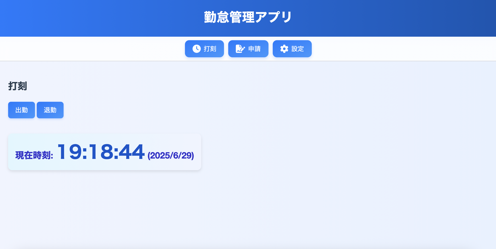
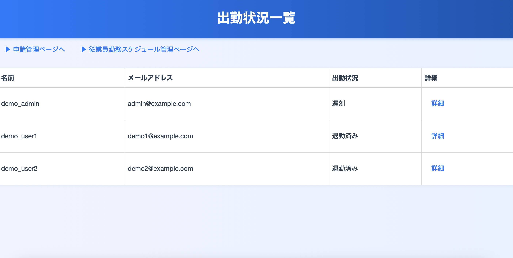

# 勤怠管理アプリ（社員TimeManager）

[デプロイページはこちら → https://shaintimemanager.web.app](https://shaintimemanager.web.app)

このアプリは、従業員の出退勤打刻や各種申請をWeb上で行える勤怠管理システムです。  
社員ページと管理者ページを分けて設計し、シンプルで直感的に操作できるインターフェースを提供しています。

---

## 🔧 主な機能

### 👨‍💼 社員ページ
- 出勤・退勤打刻（現在時刻 + 位置情報を記録）
- 各種申請機能（遅刻・残業・休日出勤・休暇など）
- 自身の出勤履歴や申請状況の確認

### 🛠 管理者ページ
- 全社員の出退勤履歴の確認（月別/社員別）
- 各種申請（残業・休暇など）の承認/却下/保留操作
- 社員ごとの出勤スケジュール設定（曜日・勤務時間など）
- 出勤ステータスのリアルタイム表示（出勤中・退勤済み・遅刻・休暇中など）

---

## 📁 使用技術

- HTML / CSS / JavaScript
- Firebase Authentication（ログイン認証）
- Firebase Firestore（リアルタイムデータベース）
- Firebase Hosting（Webアプリ公開）

---

## 🚀 公開URL

**https://shaintimemanager.web.app**

スマートフォンやPCブラウザからアクセス可能です。

---

## 🔐 デモログイン情報

| 役割     | メールアドレス       | パスワード  |
|--------|------------------|------------|
| 一般ユーザー1 | demo1@example.com | Demo@1234  |
| 一般ユーザー2 | demo2@example.com | Demo@1234  |
| 管理者    | admin@example.com | Admin@1234 |

※ Firebase Authentication であらかじめ登録済み

## 📱 デモ用QRコード

以下のQRコードをスマートフォンで読み取ると、各ユーザーのログインページにアクセスできます。

### 👨‍💼 社員ログインQRコード

- demo_user1  
  

- demo_user2  
  

### 🛠 管理者ログインQRコード

- demo_admin  
  

---

## 📷 スクリーンショット

### 👨‍💼 社員画面

### 🛠 管理者画面

📜 ライセンス

MIT License
自由に改変・再利用可能です（商用利用も可）。

📬 開発者

作成者：taerunda
ご質問・ご相談は https://www.napiblog.fun/help/ までご連絡ください。

